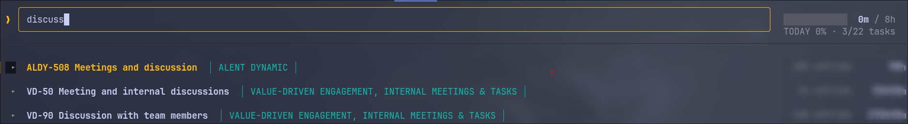

# tsk

A keyboard-only timesheet client for the terminal. It lists the tasks assigned to you
in Strativ's ERP360 (Odoo 16), expands each one into its timesheet lines, and logs,
edits and deletes hours without leaving the keyboard.



Written in Go with [Bubble Tea](https://github.com/charmbracelet/bubbletea). One static
binary, no CGO.

## Contents

- [Features](#features)
- [Installation](#installation)
  - [Download a binary (no Go required)](#download-a-binary-no-go-required)
  - [Build from source](#build-from-source)
- [First run](#first-run)
  - [Option A — a `pass` entry (recommended)](#option-a--a-pass-entry-recommended)
  - [Option B — environment variables (no `pass`)](#option-b--environment-variables-no-pass)
- [Usage](#usage)
  - [Keymap](#keymap)
  - [Typing hours and dates](#typing-hours-and-dates)
  - [The date jump](#the-date-jump)
- [Configuration](#configuration)
  - [Custom keybindings](#custom-keybindings)
  - [Environment variables](#environment-variables)
- [How syncing works](#how-syncing-works)
- [Files it touches](#files-it-touches)
- [Troubleshooting](#troubleshooting)
- [Development](#development)

## Features

- **All your tasks in one list.** Pulled from ERP360, no hunting through the web UI.
- **See the hours already logged.** Open a task, its entries show up as a table.
- **Log time in a few keystrokes.** Date, what you did, hours — saved straight into ERP360.
- **Fix mistakes.** Change or delete any entry you logged, from the same screen.
- **Typed hours are never lost.** A failed save keeps them on screen and says so.
- **Only your own hours.** A colleague's time on the same task never counts as yours.
- **"Where did Tuesday go?"** One key lists a whole day across every task, with its total.
- **A progress bar for today.** How far through your 8 hours, updated as you type.
- **A month at a glance.** `d` opens a dashboard: hours logged per day, against what was
  expected, red/amber/green by how close to 8 hours, weekends and holidays labelled
  instead of drawn. `<` / `>` step to the previous or next month.
- **The whole month's target, not just today's.** `logged 80:00 / 152:00`, so a shortfall
  reads against what the month is billed for.
- **Check in and out.** `c` on the dashboard: a boxed button, green to check in, amber to
  check out, `WFH`/`OFFICE` and the running time beside it.
- **A year of time off on one screen.** `o` opens a calendar of every day you took off,
  coloured by leave type, with public holidays and weekends dimmed and this month's caret
  where today is. Half days show as half-filled dates, requests still waiting on approval
  as underlined ones.
- **Your leave balances, from the ERP.** Four boxes above the calendar — `sick Time Off`,
  `9`, `DAYS AVAILABLE` — and each type's own initial filters the year down to it.
- **Ask for time off without leaving the terminal.** `n` opens a one-line form: leave type,
  full or half day, the dates, why. The days light up on the calendar as you type them, and
  ✓ files the request with the ERP after showing you exactly what it is about to send.
- **This month's canteen meals, booking and cancelling them.** `m` opens a month grid with one
  bar per meal per day — amber breakfast, paprika lunch, green snacks — booked meals solid, open
  slots hueless, weekends and office holidays bare, and the week's menu pinned down the right.
  `b` books today, tomorrow, the week ahead or a range you type; `c` cancels the same way and
  the calendar shows the day as it will be; `x` clears one day whole. `<` / `>` step months.
- **Never left wondering if it's working.** A spinner marks every request in flight —
  reading tasks, logging hours, reading the month or the year.
- **Find a task by typing.** The list narrows as you go.
- **No mouse, ever.** `?` lists the keys the current screen takes.
- **Change any key, on every screen or just one.** Rebind anything in a small text file; a
  `[keys.meal]` table changes a key on that screen alone.
- **Your API key stays private.** Encrypted at rest, never written to a file or a screen.
- **Works with no internet.** Everything is cached; entries reach the ERP when you are back.

## Installation

### Download a binary (no Go required)

Grab the executable for your platform from the
[releases page](https://github.com/strativ-dev/tsk-tui/releases/latest), then:

```fish
chmod +x tsk-linux-amd64      # or tsk-darwin-arm64
mv tsk-linux-amd64 ~/go/bin/tsk    # anywhere on your PATH works
```

Each one is a single static binary — no CGO, no shared libraries, nothing else to
install. Only two platforms are built: Linux amd64 and macOS Apple Silicon (arm64). On
anything else, build from source below.

On macOS, Gatekeeper will refuse to run it the first time since it is not notarized:
`xattr -d com.apple.quarantine tsk-darwin-arm64` clears that.

### Build from source

Go 1.22 or newer is the only hard requirement. Linux and macOS are the same commands;
there is no CGO and nothing platform-specific in the build.

```fish
git clone git@github.com:tasnim-strativ/tsk-tui.git
cd tsk-tui
go install ./cmd/tsk        # ~/go/bin/tsk
```

Or build in place:

```fish
go build -o tsk ./cmd/tsk
./tsk
```

Make sure `~/go/bin` is on your `PATH` if you used `go install`.

Cross-compiling for another platform — say, a Linux machine building the Mac binary —
is one environment variable, no C toolchain required:

```fish
env GOOS=darwin GOARCH=arm64 CGO_ENABLED=0 go build -o tsk-darwin-arm64 ./cmd/tsk
```

[`pass`](https://www.passwordstore.org/) is what keeps your API key encrypted, and it is
the recommended way to run this — see [Option A](#option-a--a-pass-entry-recommended).
On macOS: `brew install pass gnupg`, plus `brew install pinentry-mac` so the GPG
passphrase prompt has somewhere to appear. On Linux, your package manager has `pass`.

If you would rather not run a password store, [Option B](#option-b--environment-variables-no-pass)
works without it.

## First run

You need an **Odoo API key** and the **database name**. Generate the key in ERP360
under *Preferences → Account Security → New API Key*.

The database name is deliberately **not in this repo** — it is half of what someone
needs to reach the ERP over JSON-RPC. Two ways to get it:

- Ask [odoo baba](https://strativworkspace.slack.com/team/U02MFUYHBFU) on Slack.
- Read it from your own session: log in to
  [erp360.strativ.se](https://erp360.strativ.se), open the browser console and run

  ```js
  await fetch('/web/session/get_session_info', {
    method: 'POST',
    headers: {'Content-Type': 'application/json'},
    body: '{"jsonrpc":"2.0","method":"call","params":{}}'
  }).then(r => r.json()).then(d => d.result.db)
  ```

  The string it prints is the database name.

Now hand both to `tsk`, either way below. **Pick one** — each is complete on its own.

### Option A — a `pass` entry (recommended)

Uses [`pass`](https://www.passwordstore.org/), the standard Unix password manager, so the
key stays encrypted at rest and `tsk` can rotate it for you with `K`. Both values live in
one entry, secret on the first line and the database below it, which is `pass`'s own
convention for metadata:

```fish
pass insert -m tsk/api-key
```

Type the two lines and end with `ctrl+d`. The entry should look like this — the API key
**first**, on its own line, and the database on a `db:` line under it:

```
9f3c1a7e2b5d8406f1ae7c3b95d20e4867fa1cb2
db: example_erp_db
```

That is exactly what `pass show tsk/api-key` prints back. `tsk` reads line one as the key
and looks for `db:` in the lines below it, so the order matters — a `db:` line on top
would be read as your key.

(Both values above are made up — use your own key and the database name you looked up.)

Then run `tsk`. If the entry does not exist yet, it asks for the key on the first screen,
saves it to `pass`, and fetches. `esc` at that prompt works offline on whatever is
cached.

### Option B — environment variables (no `pass`)

Nothing to install, nothing encrypted. `tsk` reads `$TSK_API_KEY` before it looks for a
password store, so `pass` is never invoked at all.

Put the two values in your **shell's config file**, so they are there in every shell and
you never type them again. Open the file for your shell in an editor and add:

**fish** — `~/.config/fish/config.fish`

```fish
set -gx TSK_API_KEY 9f3c1a7e2b5d8406f1ae7c3b95d20e4867fa1cb2
set -gx TSK_ODOO_DB example_erp_db
```

**zsh** — `~/.zshrc` · **bash** — `~/.bashrc`

```bash
export TSK_API_KEY=9f3c1a7e2b5d8406f1ae7c3b95d20e4867fa1cb2
export TSK_ODOO_DB=example_erp_db
```

Both values above are made up — use your own key and the database name you looked up.

Then pick up the change and run it:

```fish
exec fish            # or: source ~/.zshrc — or just open a new terminal
tsk
```

Three things to know about this route, and why Option A is the recommended one:

- **Edit the file, do not type the `export` at your prompt.** A command line with the
  key in it lands in your shell history in plain text.
- **The file is plaintext.** Keep it to yourself — `chmod 600 ~/.config/fish/config.fish`
  (or `~/.zshrc`) — and remember the key is then in the environment of every process
  that shell starts.
- **`K` cannot rotate the key** on this route, because saving goes through `pass insert`.
  Change the key by editing the same config file.

### Either way

Without a database name — no `db:` line and no `$TSK_ODOO_DB` — the task list still
loads, but timesheet lines cannot: the status line will say `no Odoo database`.

## Usage

`tsk` starts on the task list. Press `l` to open a task, `a` to add an entry, `enter`
to edit the row under the cursor, `x` to delete it, `q` to quit.

Press `?` for the keys the current mode takes — the footer lists them, `?` again puts them
away. It is generated from the same bindings the app matches on, so it cannot drift from
what the keys actually do.

### Keymap

These are the defaults — see [Custom keybindings](#custom-keybindings) to change them.

**Task list** (where it starts)

| Key | Does |
|---|---|
| `j` / `k` | next / previous task |
| `g` / `G` | first / last |
| `ctrl+f` / `ctrl+b` | half a screen down / up |
| `l` | expand the task, focus its rows |
| `h` | collapse |
| `/` | date jump — lists that day across every task |
| `d` / `o` / `m` / `t` | dashboard / time off / meals / back to the tasks (`2` / `3` / `4` / `1` too) |
| `r` | re-fetch tasks from the ERP |
| `K` | replace the stored API key |
| `i` | focus the search field |
| `ctrl+u` | clear the search and focus it |
| `?` | show or hide the key list |
| `q` | quit (asks first; `ctrl+c` quits at once) |

`d` / `o` / `m` / `t` and `?` work from anywhere that is not typing into a field, so they
reach the tabs and the key list from inside a task too.

**Inside a task**

| Key | Does |
|---|---|
| `j` / `k`, `g` / `G`, `ctrl+f` / `ctrl+b` | move between rows |
| `a` | new entry at the top, dated today |
| `enter` | edit the focused row in place |
| `x` | delete the focused row (asks; `y` only) |
| `/` | jump to a date within this task |
| `h` | collapse and go back to the task line |
| `esc` | back to the task line, still expanded |
| `i` | collapse and focus the search field |
| `ctrl+u` | collapse, clear the search, focus it |
| `q` | quit (asks first; `n` returns to these rows) |

**Dashboard** (`d` or `2`)

One chart: hours logged per day for the whole month, weekends and holidays labelled
instead of drawn. The days are laid out in columns so the whole month fits one screen —
four columns on an 80×24 terminal, one on a tall one — and every day keeps its hours
printed beside its bar. Top right is the ERP's own clock — where you are
working, when you checked in, how long ago that was, and the button `c` presses.

| Key | Does |
|---|---|
| `g` / `G` | start / end of the month |
| `ctrl+f` / `ctrl+b` | half a screen of days, down / up |
| `<` / `>` | previous / next month — `>` stops at the current one |
| `c` | check in, or check out (asks first, `y` only) — the boxed button says which |
| `r` | re-read the month from the ERP |
| `t` | back to the tasks (`1` too) |
| `i` / `ctrl+u` | back to the tasks, in the search field |
| `?` | show or hide the key list |
| `q` | quit (asks first) |

There is no `j` / `k` here: the chart is one picture of the month, not a list, so it moves
a screenful at a time. The month, its totals and the axis stay put while the days move.

**Time off** (`o` or `3`)

A calendar of the whole year — three months a row from about 120 columns, divided by
hairlines with the month you are looking at tinted, ISO week numbers down the left — with
your leave balances boxed above it and, from about 88 columns, the public holidays pinned in a
column down the right, which stays put while the months scroll under it. A one-day holiday
says which weekday it takes — `Aug 5 (Wed)`. A day off is a filled badge in its leave type's colour, a **half day** fills half of it, and a
request still waiting on approval is **underlined**. The days you are typing on the request
line are reversed out in the accent. Weekends and holidays are filled badges, so the
days nobody works read as days rather than as gaps; the month in view carries the caret.

| Key | Does |
|---|---|
| `h` / `l` | previous / next month |
| `j` / `k` | a row of months down / up |
| `g` / `G` | January / December |
| `ctrl+f` / `ctrl+b` | a row of months down / up, as `j` / `k` |
| `enter` | list this month's time off — `19 Aug (Wed)  casual : Baby got sick`; `esc` closes |
| `n` | new time off request — the form opens on the line above the calendar |
| `s` `c` `a` `p` | show only sick / casual / annual / paternity — the initials of your own leave types, as shown on the boxes |
| `esc` | clear the filter (the same letter again does too) |
| `r` | re-read the year from the ERP |
| `t` / `d` | back to the tasks / the dashboard (`1` / `2` too) |
| `i` / `ctrl+u` | back to the tasks, in the search field |
| `?` | show or hide the key list |
| `q` | quit (asks first) |

**Asking for time off** — `n` reveals the request line and focuses the leave type:

```
             ╭──────────╮ ╭────────────╮ ╭──────────╮     ╭──────────╮ ╭──────────────╮ ╭───╮ ╭───╮
new timeoff  │ Annual ▾ │ │ full day ▾ │ │ 21/01/26 │  →  │ 23/01/26 │ │ Coast trip   │ │ ✓ │ │ ✕ │
             ╰──────────╯ ╰────────────╯ ╰──────────╯     ╰──────────╯ ╰──────────────╯ ╰───╯ ╰───╯
```

The field with the keys has an accent frame; a date you have just tabbed onto is shown
reversed out, because the next keystroke replaces the whole value. ✓ and ✕ are buttons
rather than fields, so the one the keys are on fills — green and red, with its mark in
white — and ✕ closes the line without asking, since nothing has been filed yet.

| Key | Does |
|---|---|
| `tab` / `shift+tab` | next / previous field |
| `j` / `k` / `space` | change the focused dropdown (leave type, full or half day, morning or afternoon) |
| `s` `c` `a` `p` | on the leave type, pick it outright — the same initials the boxes and the filters use |
| `enter` | next field; on ✓ it asks before filing, on ✕ it closes the line |
| `ctrl+u` | clear the focused field |
| `esc` | discard the request (asks first) |

Dates are `dd/mm/yy` and fill themselves in: type `21`, press `tab`, and it becomes the 21st
of this month. The first keystroke on a date replaces it whole, so you never delete what is
already there, and moving the start date past the end drags the end along so a range never
quietly covers days you did not ask for. Every day the request covers lights up on the calendar as you type, and the
month it lands in scrolls into view.

✓ shows what it is about to send — type, dates, duration, what it costs against your balance,
description — and takes `y` only. The request goes to the ERP exactly as the web UI's own form
would file it, already submitted, and waits for your manager's approval there.

Two things it checks before sending: a day you already have time off on is refused outright
(the ERP takes one leave per day), and a request for more days than you have left is flagged in
the confirmation rather than blocked — some leave types are allowed to run negative, and the
ERP is the one that decides.

**Meals** (`m` or `4`)

This month's canteen bookings: a Monday-first grid with one short bar per meal per day —
solid and coloured for a meal you have booked, thin and grey for a slot still open, nothing
at all on a weekend or an office holiday. A meal already eaten keeps its colour, dimmed. The
cursor carries a band; today's date is underlined.

From about 92 columns the week's menu is pinned down the right: one block per weekday with a
line per meal — what the canteen is serving, the choice first — with **today's whole block in
amber**, heading and dishes. It follows the cursor, so `j` brings next week's menu with it.

`b` opens a booking line under the calendar: when — today, tomorrow, the week ahead, or a
custom range with two dates, stepped with `j`/`k` — then a tick per meal, `b` breakfast, `l` lunch,
`s` snacks, all on to start with — one to a line, so `tab` runs scope → dates → ✓ → ✕ and
skips them. The days it would book light up on the calendar as you type, and a range that
crosses into the next month puts that month on screen beside this one. `enter` on ✓ shows what
it is about to book and takes `y`; ✕ or `esc` closes the line with nothing filed. Days the
canteen is shut, days already gone and meals you already have are dropped before the request,
and whatever the ERP refuses is reported in its own words.

`c` opens the same line with the opposite verb — it cancels what `b` books, over the same
scopes and ticks, and takes `y` only. The calendar shows the day **as it will be**: tick lunch
and the lunch bar comes off it. A meal with nothing booked in the chosen days is disabled and
says `none`. Whichever line is open, the other's label stays but goes dim: its key does nothing
until `esc` closes the row.

`x` clears the cursor day — every meal on it — after a prompt that names them, and takes `y`
only; `c` is the key for cancelling chosen meals over chosen days. Days
past their booking cutoff are refused before the request goes out — the ERP will not change
them.

| Key | Does |
|---|---|
| `h` / `l` | previous / next day |
| `j` / `k` | a week down / up |
| `g` / `G` | first / last day of the month |
| `b` | book meals — the line opens under the calendar |
| `c` | cancel meals — the same line, the opposite verb |
| `x` | clear this day — every meal on it (asks; `y` only) |
| `<` / `>` | previous / next month — `>` stops at the current one |
| `r` | re-read the month from the ERP |
| `t` / `d` / `o` | back to the tasks / the dashboard / time off (`1` / `2` / `3` too) |
| `i` / `ctrl+u` | back to the tasks, in the search field |
| `?` | show or hide the key list |
| `q` | quit (asks first) |

**Editing an entry**

| Key | Does |
|---|---|
| `tab` / `shift+tab` | date → description → hours → ✓ → ✕ |
| `enter` | next field, or commit on ✓ |
| `ctrl+u` | clear the current field |
| `esc` | cancel — immediately when editing, after a prompt for a new entry |

**Search field**

| Key | Does |
|---|---|
| any key | filter by title and tag, live |
| `esc` / `enter` | back to the task list |
| `ctrl+u` | clear the query and collapse everything |

Destructive prompts — quitting and deleting a line — take **`y` only**, so a reflexive
`enter` cannot fire them.

### Typing hours and dates

Durations are read however you write them, and normalized when you leave the field:

```
7h30m → 7:30      7.5 → 7:30      90m → 1:30      7:30 → 7:30      7 → 7:00
:30 → 0:30        7: → 7:00
```

Dates fill in what you leave out, relative to the row you are editing (or today for a
new entry):

```
8       → 08/08/26     (day only: keeps the month and year)
8/9     → 08/09/26     (day and month: keeps the year)
8/9/26  → 08/09/26
```

When you edit a row the date arrives selected — the first keystroke replaces it, `tab`
keeps it.

### The date jump

`/` means two different things, because there are two different questions:

- **From the task list** — "where did that day go?" `/12` resolves to the 12th of this
  month and opens a modal listing every entry logged on it, in any task, with the day's
  total. Nothing expands. `esc` closes it.
- **Inside a task** — "where is that row?" Here the date is matched part by part, so
  `/12` finds the 12th of **any** month among that task's rows, `/12/7` any 12th of
  July. The cursor moves to it; no modal covers the rows you are reading.

Either way the matching rows stay marked until you clear the jump (`enter` on an empty
prompt, or `ctrl+u`).

## Configuration

### Custom keybindings

Every binding is a default, not a fact. Write the current keymap to the config file and
edit what you like:

```fish
# Linux
mkdir -p ~/.config/tsk
tsk --print-keys > ~/.config/tsk/config.toml
```

```fish
# macOS
mkdir -p ~/Library/Application\ Support/tsk
tsk --print-keys > ~/Library/Application\ Support/tsk/config.toml
```

```toml
[keys]
half_down = ["ctrl+d"]          # back to vim's key
down      = ["j", "down", "n"]  # several keys per action
quit      = []                  # an empty list unbinds it; ctrl+c always quits
```

Any action can also be rebound **on one screen only**, with a `[keys.<tab>]` table —
`tasks`, `dash`, `time`, `meal`:

```toml
[keys]
delete = ["x"]        # everywhere

[keys.meal]
delete = ["d"]        # ...but on the meal tab, d cancels the day's meals
```

A screen's own binding is matched before the tab keys, so the example above gives up `d` for
the dashboard **on the meal tab only**. In the global table a key the tab bar owns is refused
at startup instead, since the tab keys are matched first and the action could never fire.

Which actions a screen actually reads — anything else in its table is accepted and simply
never fires there:

| Screen | Actions it uses |
|---|---|
| `[keys.tasks]` | `down` `up` `top` `bottom` `half_down` `half_up` `expand` `collapse` `jump` `edit` `add` `delete` `refresh` `set_key` `search` `clear_search` `clear_query` `focus` `next` `prev` `clear_field` `accept` `cancel` `quit` |
| `[keys.dash]` | `top` `bottom` `half_down` `half_up` `prev_month` `next_month` `clock` `refresh` `search` `clear_search` `quit` |
| `[keys.time]` | `collapse` `expand` `down` `up` `top` `bottom` `half_down` `half_up` `accept` `new_leave` `back` `refresh` `search` `clear_search` `quit` — plus `next` `prev` `cycle` `clear_field` on the request line |
| `[keys.meal]` | `collapse` `expand` `down` `up` `top` `bottom` `half_down` `half_up` `prev_month` `next_month` `book_meal` `drop_meal` `delete` `refresh` `search` `clear_search` `quit` — plus `next` `prev` `cycle` `clear_field` `accept` `cancel` on the booking line |

`help` (`?`), the four tab keys (`tasks_tab` `dash_tab` `time_tab` `meal_tab`) and the confirm
keys (`yes` `yes_only` `no`) work on every screen, so they belong in the global `[keys]` table
rather than in one screen's.

Keep only the lines you want to change — anything absent keeps its default, and **no
config file at all is perfectly fine**. Action names are listed by `--print-keys`.
Keys are spelled the way Bubble Tea spells them: a single character, a `ctrl+` /
`alt+` / `shift+` compound, or one of `enter esc tab shift+tab space backspace delete
up down left right home end pgup pgdown`.

A misspelled key or an unknown action stops the program with a message rather than
starting up with a keymap that silently does nothing.

The footer follows a rebind on its own, since help and behavior read the same bindings.

### Environment variables

| Variable | Default | Purpose |
|---|---|---|
| `TSK_API_KEY` | — | use this key and skip `pass` entirely |
| `TSK_PASS_NAME` | `tsk/api-key` | which `pass` entry holds the key |
| `TSK_ODOO_DB` | — | Odoo database, overriding the `db:` line in `pass` |
| `TSK_API_URL` | `https://erp360.strativ.se` | point at staging or a local Odoo |
| `XDG_CONFIG_HOME` | `~/.config` on Linux, `~/Library/Application Support` on macOS | where the config and cache live |

## How syncing works

The REST API and JSON-RPC each cover part of the job:

| Call | Used for |
|---|---|
| `GET /api/v1/tasks/my` | your task list |
| `GET /api/v1/timesheets/hour-log-summary` | today's total, for the progress bar |
| `POST /api/v1/timesheets/log` | creating one entry |
| JSON-RPC `account.analytic.line` `search_read` | reading a task's lines |
| JSON-RPC `write` / `unlink` | editing and deleting a line |
| JSON-RPC `get_employee_hour_logs` | the dashboard's month of daily hours |
| JSON-RPC `hr.employee` / `hr.attendance` | checking in and out, and the session you are in |
| JSON-RPC `serp.meal.booking` / `serp.meal.type` | the month's canteen meals, booking and cancelling them, and the days it is shut |
| JSON-RPC `serp.meal.menu` | what the canteen is serving that week |
| JSON-RPC `hr.leave` / `hr.leave.type` | time off: the year's requests, the balances, filing one |

Worth knowing:

- **Lines are read lazily.** Expanding a task reads it once; `r` clears that so open
  tasks are read again.
- **A read merges, it never replaces.** Entries you typed but the ERP has not confirmed
  are kept, and app-created rows carry negative ids so they cannot collide with an Odoo
  line.
- **Reads are filtered to you.** Odoo's own task form lists every employee's lines;
  this does not.
- **Nothing retries by itself.** One entry per request, and a timed-out retry could
  double-log, so a failure is reported and left for you to decide.
- **The API key lives in memory, the `Authorization` header, and nowhere else.** Not in
  a URL, not in a log line, not in an error message, not in the cache file.

## Files it touches

Its own directory, plus the `pass` entry if you chose Option A:

| Platform | Directory |
|---|---|
| Linux | `~/.config/tsk/` |
| macOS | `~/Library/Application Support/tsk/` |

`$XDG_CONFIG_HOME` overrides that on either platform, so `set -x XDG_CONFIG_HOME ~/.config`
on a Mac puts everything in `~/.config/tsk/` instead.

| File | What |
|---|---|
| `tasks.json` | cached tasks and hours, so it works offline |
| `config.toml` | your keybindings (optional) |
| `pass` entry `tsk/api-key` | API key on line one, `db:` below it (Option A only) |

`tasks.json` holds real hours and task names — worth keeping out of any repo or paste.

## Troubleshooting

**`no Odoo database — add a db: line to the pass entry`**
Timesheet lines come from JSON-RPC, which needs the database name. `pass edit
tsk/api-key` and add `db: <database-name>` as the second line, or export
`TSK_ODOO_DB`.

**`pass not found — install password-store, or export TSK_API_KEY`**
You are on the `pass` route without `pass`. Either install it — `brew install pass gnupg`
on macOS, your package manager on Linux — and initialise a store (`pass init <gpg-id>`),
or switch to [Option B](#option-b--environment-variables-no-pass) and set `TSK_API_KEY`.

**A GPG passphrase prompt appears**
Expected — `pass show` runs with the terminal handed over to it, so a tty pinentry
works without corrupting the screen. `gpg-agent` caches it after the first time.

**`offline — showing the tasks on disk`**
The ERP could not be reached. Everything still works against the cache, and hours you
type are kept locally until a write succeeds.

**A task shows no entries even though Odoo has some**
The first read failed (usually the missing database name). Collapse and expand it to
try again; failures are not remembered as "already read".

**`401` / the key prompt opens by itself**
The key was rejected or revoked. `K` stores a new one.

**`ctrl+f` or `ctrl+u` seems to be swallowed**
Your terminal multiplexer or shell may claim it first. `ctrl+l` was dropped as a
binding for exactly this reason. Rebind anything that clashes — see
[Custom keybindings](#custom-keybindings).

## Development

```
cmd/tsk/         entry point
internal/model/  root model, one Update handler per mode, View
internal/parse/  hours and dates — pure, table-tested
internal/store/  the cache on disk, and the key from pass
internal/api/    REST client and Odoo JSON-RPC
internal/config/ the config.toml keymap, and where it lives per platform
internal/theme/  every color and style, in one place
```

```fish
go test ./... && go vet ./...      # the gate before any change is done
```

Conventions worth keeping: no I/O in `Update` or `View` (disk and network go through a
`tea.Cmd`), minutes are stored as minutes and formatted only when rendered, totals and
the progress bar are derived on every render rather than cached, and every parsing rule
has a table-driven test. The rendering tests assert real terminal widths — a line wider
than the screen wraps and pushes the layout out of place. `CLAUDE.md` carries the longer
reasoning behind these decisions.
